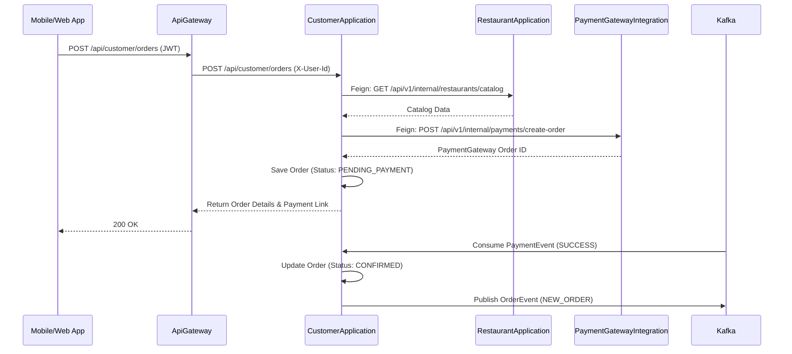

# CustomerApplication Architecture

The CustomerApplication acts as an orchestrator for the customer journey, relying on other domain services (Restaurant, Payment) via Feign clients and event streams.

## Detailed Sequence Diagram

