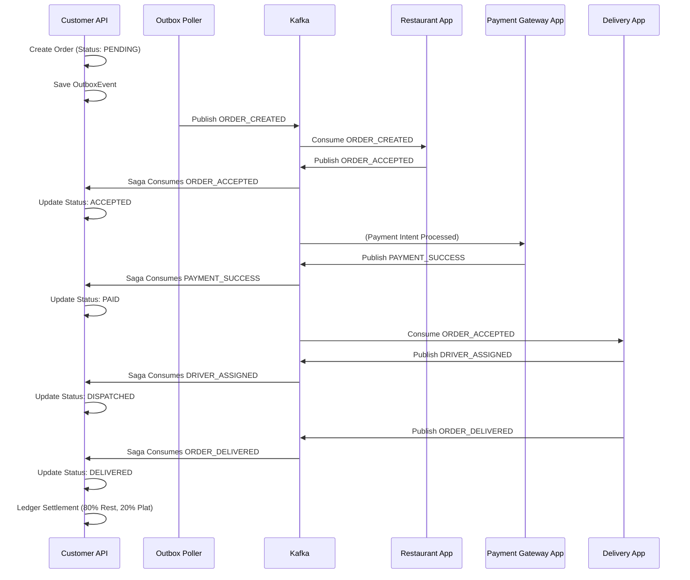

# Customer Application

The Customer Application acts as the core gateway and order state machine for the Food Delivery platform. It provides the customer-facing REST APIs and hosts the **Order Saga Orchestrator**.

## Responsibilities

1. **Customer Management**: Registration, profile handling.
2. **Order Intake**: Receiving orders, validating cart totals, and generating initial `PENDING` order states.
3. **Outbox Pattern**: Reliable publishing of initial `ORDER_CREATED` events via the transactional outbox table (`outbox_events`).
4. **Saga Orchestrator**: The `OrderSagaOrchestrator` manages the distributed transaction of a food delivery order. It listens to Kafka events from the Restaurant, Payment, and Delivery microservices to progress the order through its state machine and calculates financial ledger splits upon delivery.

## Database Schema (customer_db)

- `customers`: Profiles and auth.
- `orders`, `order_items`: Core commerce tables.
- `outbox_events`: Polled by a scheduler to guarantee at-least-once delivery to Kafka.
- `payment_intents`, `refunds`: Local materialized view of payment state to drive the saga.
- `ledgers`, `ledger_accounts`, `ledger_entries`: Double-entry accounting system to track platform fees, restaurant payouts, and delivery executive earnings upon successful order completion.

## Order Saga Sequence

## Setup & Running

1. Ensure the PostgreSQL `customer_db` is running.
2. Run `mvn spring-boot:run`. Flyway will automatically apply migrations (`V1__init_schema.sql`).
