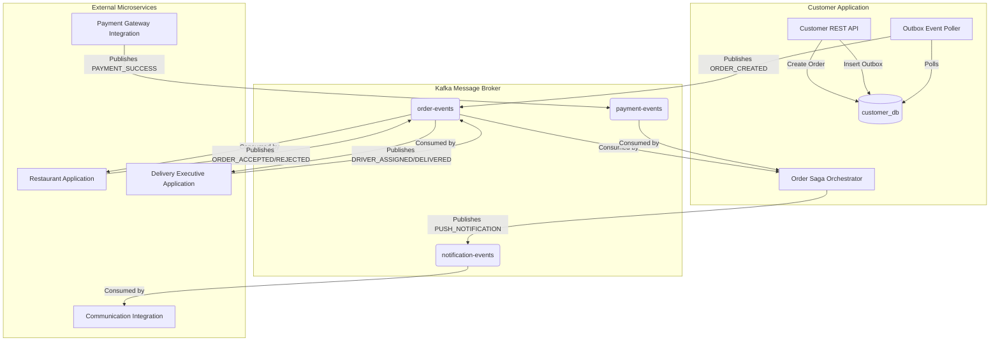
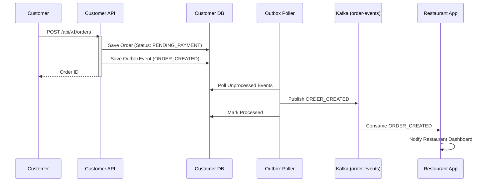
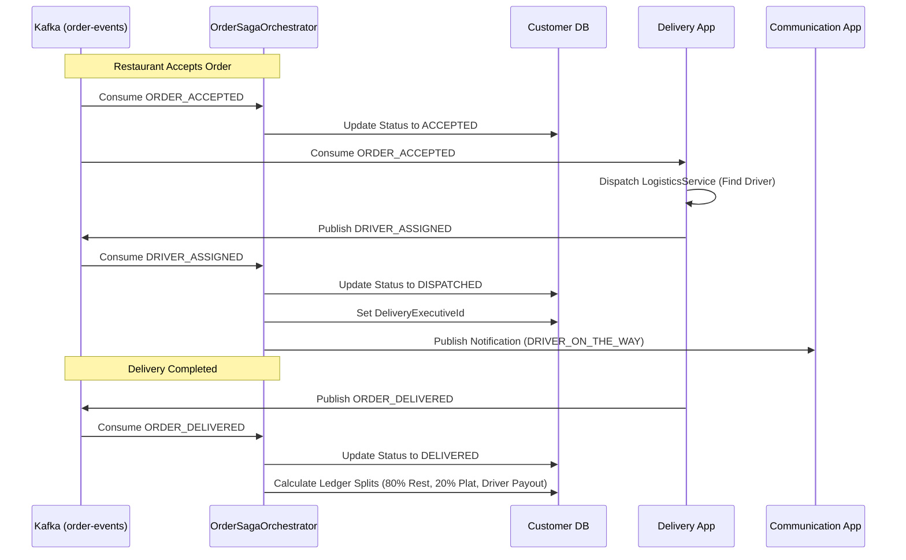

# Customer Application - System Flow Diagrams

This document illustrates the event-driven architecture and sequence flows of the `CustomerApplication`, which acts as the core Order Management and Customer Gateway for the Food Delivery platform.

## High-Level Event Architecture

## Order Creation Sequence (Saga)

## Order Fulfillment & Dispatch Sequence

